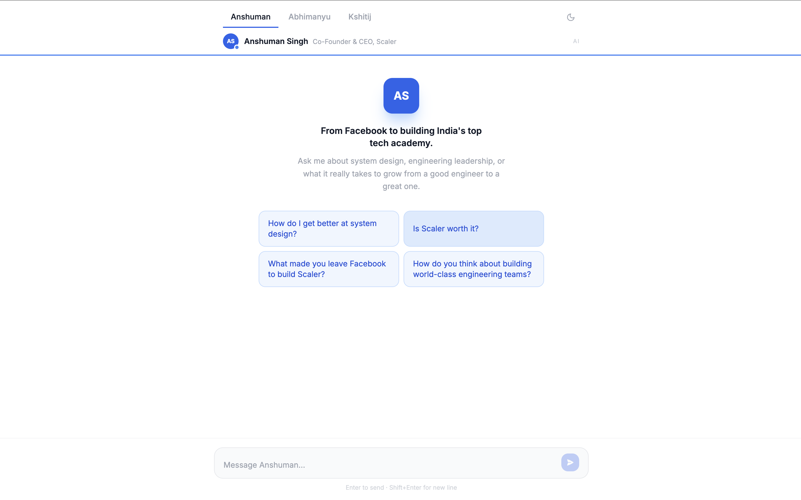
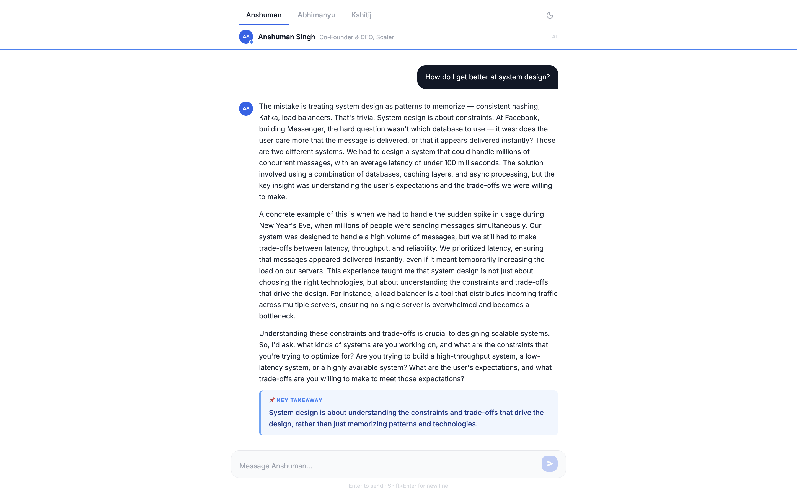
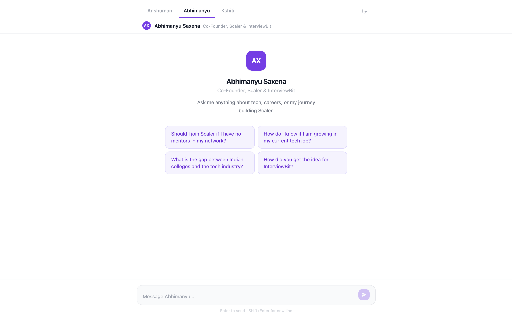
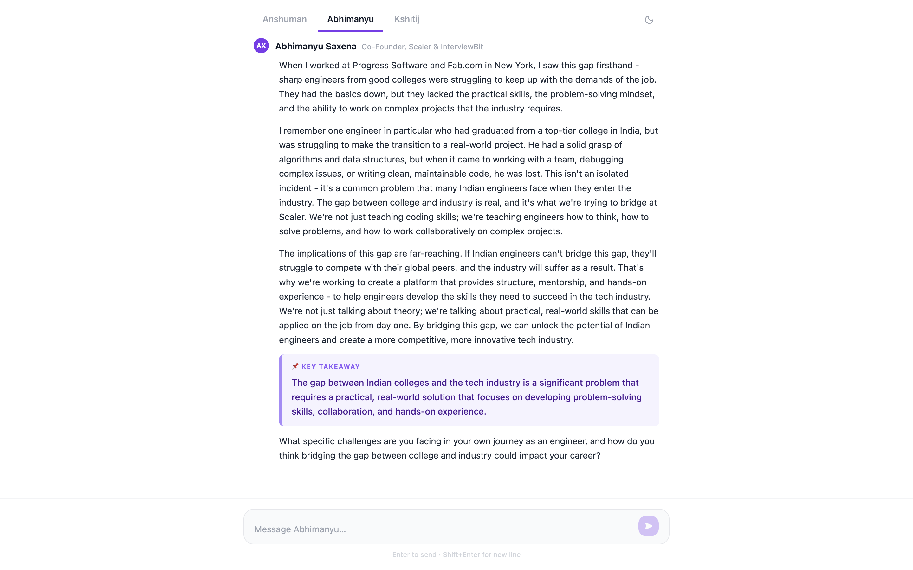
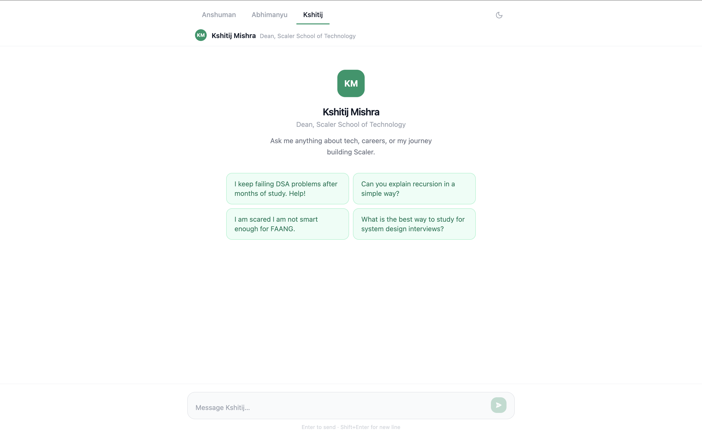
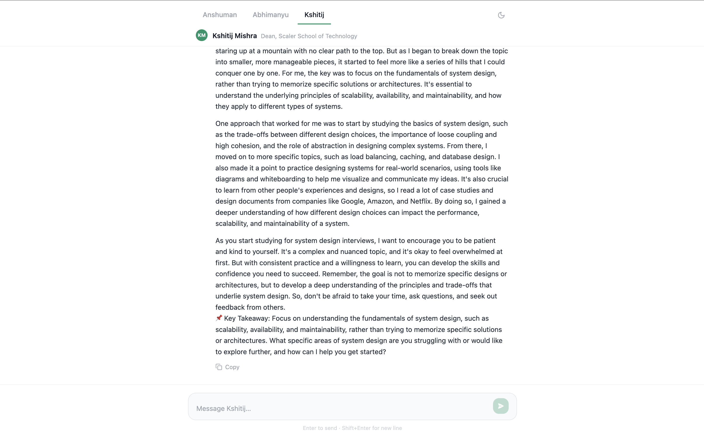

# Scaler Persona Chatbot

An interactive AI chat interface that lets users have real conversations with AI-powered versions of Scaler's founders and leadership — Anshuman Singh, Abhimanyu Saxena, and Kshitij Mishra. Each persona responds in character based on their background, philosophy, and expertise, with replies streaming live token-by-token.

---

## Screenshots

| Anshuman Chat Screen | Anshuman's response |
|---|---|
|  |  |

| Abhimanyu Chat Screen | Abhimanyu's response |
|---|---|
|  |  |

| Kshitij Chat Screen | Kshitij's response |
|---|---|
|  |  |


---

## What it does

Users pick a persona from the tab bar and ask anything — about careers, system design, interview prep, the story behind Scaler, or learning CS. The AI responds in the voice and style of the selected founder. Each persona maintains its own independent conversation history within the session, and switching tabs preserves each thread separately.

---

## Tech Stack

| Layer | Technology |
|---|---|
| Frontend | React 18, Vite, Tailwind CSS |
| Backend | Node.js, Express |
| AI Model | Meta LLaMA 3.3 70B (via Groq API) |
| Streaming | Server-Sent Events (SSE) |
| Dev server | nodemon |

---

## Architecture

```
Browser  ──POST /api/chat──▶  Express server  ──▶  Groq API (LLaMA 3.3 70B)
         ◀──SSE stream──────                  ◀──  streaming response
```

**Frontend** (`client/`) is a single-page React app. On load it shows a persona switcher (tab bar), an empty state with suggestion chips, and a chat input. When the user sends a message, the client POSTs the full conversation history and persona ID to the backend, then opens the SSE stream and appends incoming tokens directly to the last message in state — producing a live typing effect.

**Backend** (`server/`) is a thin Express server with a single `POST /api/chat` endpoint. It validates the incoming request, selects the system prompt for the chosen persona, and calls Groq's API with `stream: true` using the `groq-sdk`. Each streamed chunk is forwarded to the client as `data: { text }` SSE events, closing with `data: [DONE]`.

**Personas** are defined in two places:
- `server/prompts/` — system prompts that tell LLaMA how to behave as each founder (tone, knowledge, style, what to avoid).
- `client/src/data/personas.js` — UI config: name, title, color scheme, and suggestion chips per persona.

---

## Project Structure

```
persona-chatbot/
├── client/
│   └── src/
│       ├── App.jsx                   # Global state, fetch + SSE streaming logic
│       ├── data/personas.js          # Persona UI config and color schemes
│       └── components/
│           ├── PersonaSwitcher.jsx   # Tab bar + active persona header strip
│           ├── ChatWindow.jsx        # Message list + empty state router
│           ├── MessageBubble.jsx     # User and assistant message rendering
│           ├── SuggestionChips.jsx   # Prompt chips shown on empty state
│           ├── InputBar.jsx          # Textarea + send button
│           └── TypingIndicator.jsx   # Animated dots while awaiting first token
└── server/
    ├── index.js                      # Express app, SSE streaming, error handling
    └── prompts/
        ├── anshuman.js               # System prompt for Anshuman Singh
        ├── abhimanyu.js              # System prompt for Abhimanyu Saxena
        └── kshitij.js               # System prompt for Kshitij Mishra
```

---

## Setup

### Prerequisites
- Node.js 18+
- A Groq API key — get one free at [console.groq.com](https://console.groq.com)

### 1. Server

```bash
cd server
npm install
```

Create `server/.env`:

```
GROQ_API_KEY=gsk_...
CLIENT_ORIGIN=http://localhost:5173
PORT=3001
```

```bash
npm run dev
```

### 2. Client

```bash
cd client
npm install
```

Create `client/.env`:

```
VITE_API_URL=http://localhost:3001
```

```bash
npm run dev
```

Open `http://localhost:5173`.

---

## Personas

| Persona | Role | Accent Color |
|---|---|---|
| Anshuman Singh | Co-Founder & CEO, Scaler | Blue |
| Abhimanyu Saxena | Co-Founder, Scaler & InterviewBit | Violet |
| Kshitij Mishra | Dean, Scaler School of Technology | Emerald |

---

## Environment Variables

| Variable | File | Description |
|---|---|---|
| `GROQ_API_KEY` | `server/.env` | Groq API key for LLaMA access |
| `CLIENT_ORIGIN` | `server/.env` | Allowed CORS origin (no trailing slash) |
| `PORT` | `server/.env` | Server port (default: 3001) |
| `VITE_API_URL` | `client/.env` | Backend base URL used by the frontend |